

  

  # 🐉 Cryptoric Optimizer

  **The all-in-one Windows optimizer — clean, tweak, monitor, and take control of your PC.**

  
  
  

---

## 📖 Overview

**Cryptoric Optimizer** is a premium, all-in-one system optimization and tweaking utility designed to help you squeeze the maximum performance out of your Windows machine. Whether you're a gamer looking for higher framerates or a power user seeking a snappy, debloated experience, Cryptoric Optimizer provides a sleek, intuitive interface to manage your system settings, clean junk, and enhance overall responsiveness.

## ⬇️ Download & Installation

1. Head over to the [Releases](https://github.com/Itz-Npg/Cryptoric-Pc-Optimizer/releases/latest) page.
2. Download **`cryptoricoptimizer-0.0.6-setup.exe`**.
3. Run the installer and follow the on-screen instructions.
4. Launch **Cryptoric Optimizer** and start boosting your system performance!

> ⚠️ **Upgrading from v0.0.5 or earlier?** Uninstall the old version first — v0.0.6 uses a new app identity, so it installs alongside the old one if you don't.
>
> ℹ️ Some actions (like applying DNS changes) require administrator rights — Windows will prompt you, or launch the app elevated.

## ✨ Features

- 🏎️ **Optimization Engine** — Analyzes your CPU, GPU, Memory, and Storage and applies the best settings automatically.
- 🛠️ **System Tweaks** — 80+ categorized tweaks (General, Appearance, Performance, Privacy, Gaming, CPU, Network…) including debloating Windows, disabling telemetry, and the Ultimate Performance power plan.
- 🚀 **Startup Manager** — See every app that launches with Windows, measure its real impact, and enable or disable it in one click.
- 🧹 **Deep Cleaner** — Temporary files, prefetch, recycle bin, Windows Update cache, browser caches (Chrome, Edge, Firefox, Brave), Delivery Optimization, and more.
- 🧠 **Memory Automation** — Live memory monitoring with 1-second sampling, an auto-clean threshold, and scheduled memory trims (2 / 5 / 10 / 30 min, 1 hour, or a custom interval).
- 🖥️ **Tray Integration** — Runs quietly in the system tray with a live memory readout, promoted to the Windows 11 taskbar corner.
- 🌐 **DNS Manager** — Benchmark DNS resolvers for latency and apply the winner. Clear errors if the app isn't elevated — no silent failures, and only real physical network adapters are touched.
- 🛡️ **Restore Points** — Create and manage system restore points before making changes, so you can always revert.
- 🧰 **Utilities** — Storage Sense, system information, Fast Startup management, quick driver restarts, and more.
- 📦 **Apps Manager** — Review installed applications and uninstall bloatware in seconds.

## 📸 Screenshots

### Dashboard
*Real-time hardware monitoring and optimization readiness.*
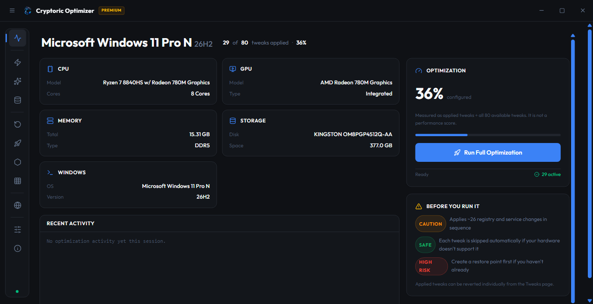

### Tweaks
*80+ safe and advanced system tweaks, categorized and labeled by risk.*
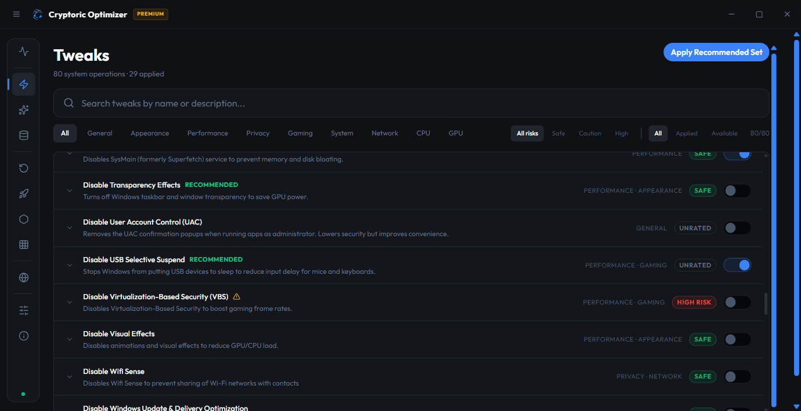

### Cleaner
*Deep clean junk, caches, and leftovers to reclaim disk space.*
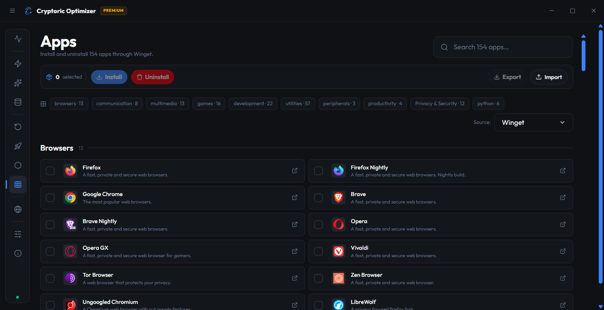

### Memory
*Live memory automation with scheduled trims.*
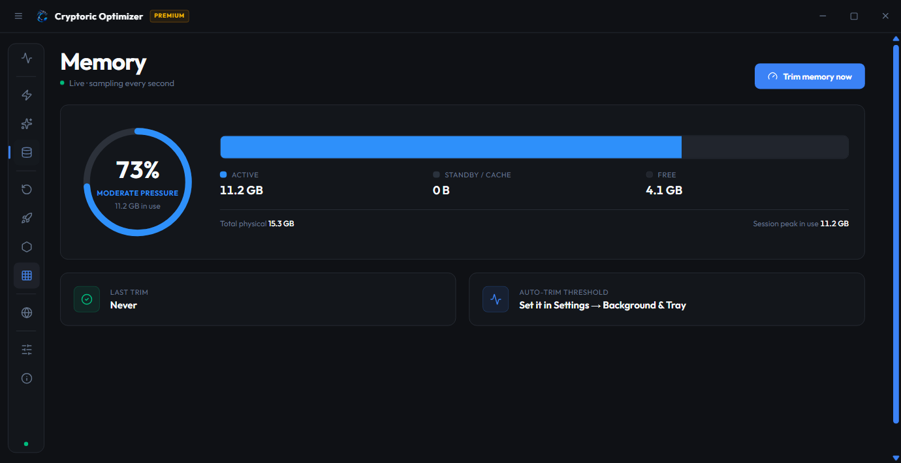

### Startup Manager
*Control what launches with Windows and how much it costs you.*
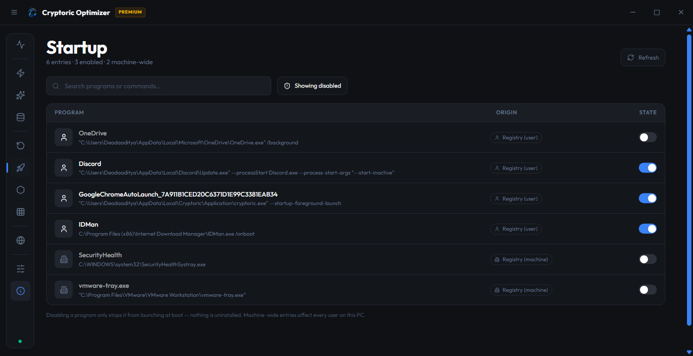

### Utilities
*Quick access to built-in Windows utilities and advanced tools.*
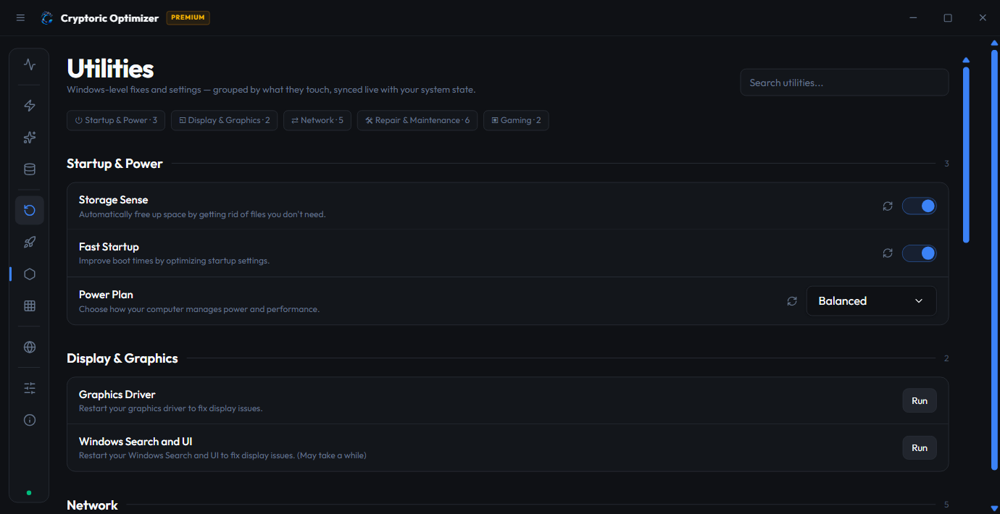

### DNS Manager
*Benchmark and apply the fastest DNS servers — with honest, clear errors.*
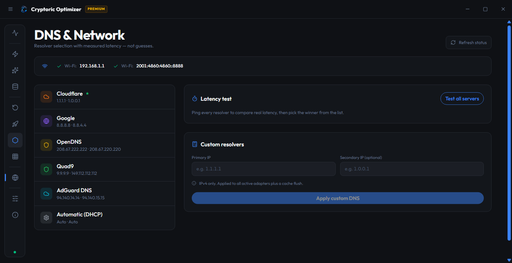

### Restore
*Peace of mind with integrated restore point creation.*
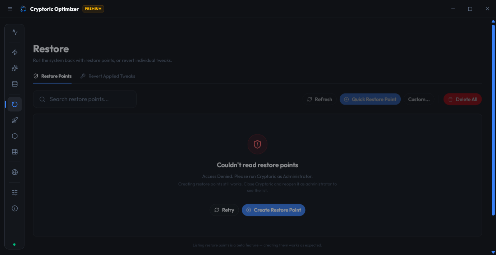

### Apps
*Manage installed applications and easily uninstall bloatware.*
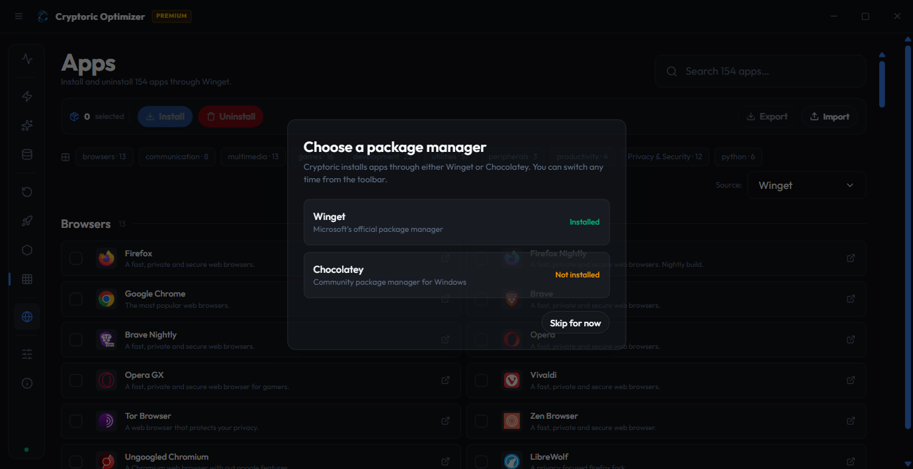

### Settings
*Customize Cryptoric Optimizer — including the memory automation schedule.*
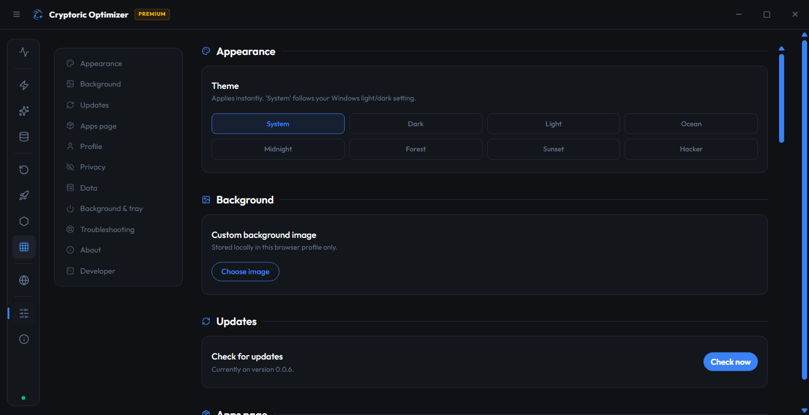

---

## 💬 User Feedback
*See what the community is saying about Cryptoric Optimizer!*

  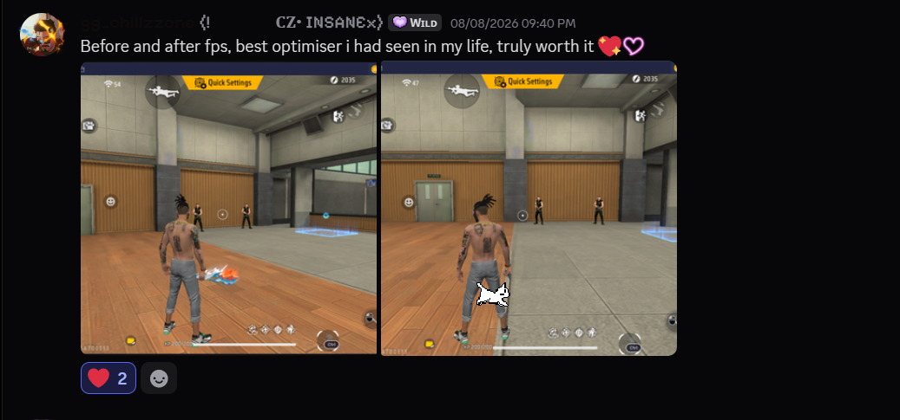
  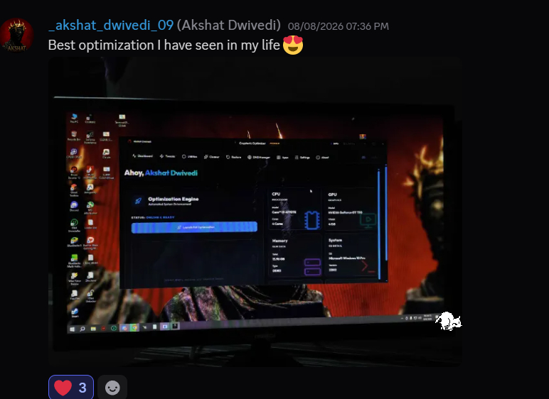

---

## 👤 Author

**[Itz-Npg](https://github.com/Itz-Npg)** — creator and sole developer of Cryptoric Optimizer.

## ⚠️ Disclaimer
While Cryptoric Optimizer aims to be safe (with tweaks labeled as 'Safe', 'Caution', or 'Risky'), altering system settings always carries some risk. **Always create a restore point** before applying major tweaks. The developers are not responsible for any system instability or data loss.
